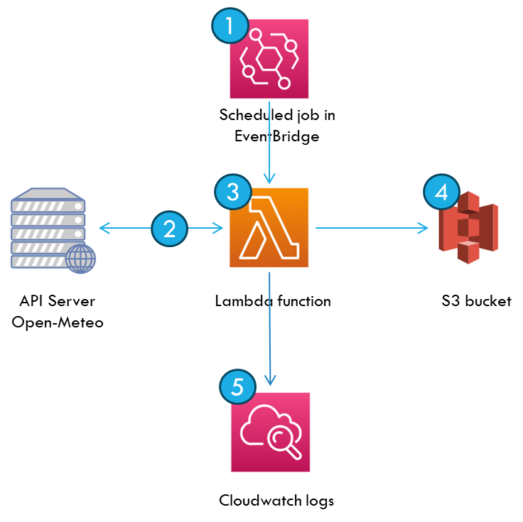
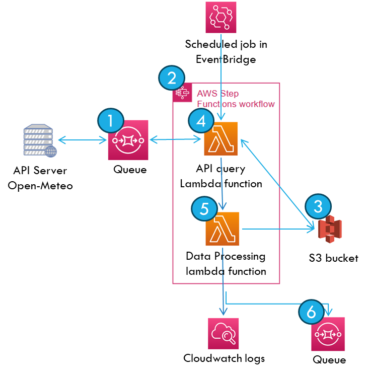

# infra_configs
Terraform scripts to provision resources on AWS for 'ingest-weather-daily' project

Problem Statement:
Design pipeline to ingest, process and store weather data on daily basis

Assumptions for this use case:
1. Transformation logic is simple - simple fetch and publish. There are no joins between datasets, no lookups to external sources
2. There are no parallel or dependent tasks Not dependent on other tasks, neither sits in between ordered set of tasks
3. This is a simple use case - overhaul/fundamental redesign needed if multiple sources need to aggregated, joins between them are needed

Architecture

Sequence of tasks:
1. Scheduled job in Eventbridge trigger lambda job ‘ingest-weather-daily’ on daily schedule
2. Lambda function requests the Open-Mateo API server for weather data and receives request in JSON file format
3. Lambda function writes the raw data to S3 location, performs basic transformation to JSON file and converts data into parquet file
4. Lambda function writes processed data in parquet format to S3 location
5. All logs are sent to Cloudwatch for monitoring and alerting 

Future Architecture

Improvements:
1. SQS as a buffer between API server and Lambda
2. Step Function with multiple lambda functions
Lambda function queries S3 for project “config” – list of query parameters, list of target columns, mapping between them
3. Lambda function queries API server and write raw data to S3
4. Lambda function transforms data to desired table and writes to S3
5. Failed executions are added to Dead Letter Queue for retries

Note: This design can be translated to Orchestration/Containerized solution platform to move away from Serverless as level of abstractions are similar:
1. Step Functions will be replaced by Orchestration platform (Airflow or Dagster). This enables more complex requirements like look ups, joins and parallel tasks
2. Each Lambda function can be replaced by containerized application (based on Spark or equivalent) executed on EMR clusters on EKS

